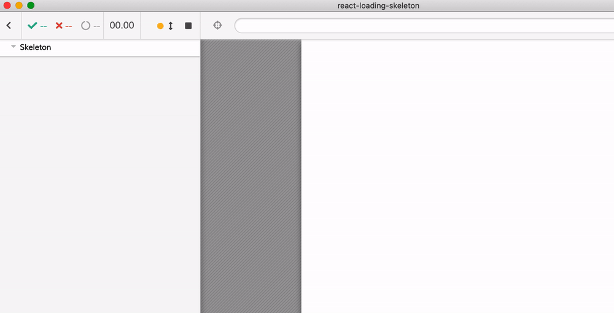
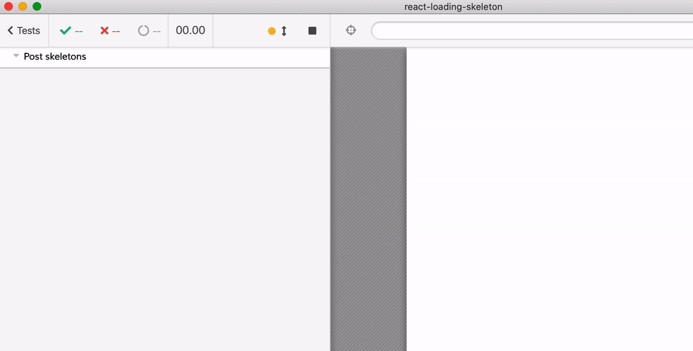

# react-loading-skeleton

 

Forked from [dvtng/react-loading-skeleton](https://github.com/dvtng/react-loading-skeleton) to show [cypress-react-unit-test v2](https://github.com/bahmutov/cypress-react-unit-test/tree/feature/cypress-mount-mode)



See [stories/Post.cy-spec.js](stories/Post.cy-spec.js) and [stories/Skeleton.cy-spec.js](stories/Skeleton.cy-spec.js)

Example test and test video

```js
it('loads title after timeout', () => {
  const Demo = () => {
    // at first there is not title, no children
    const [title, setTitle] = React.useState('');
    const [text, setText] = React.useState('');

    setTimeout(() => {
      setTitle('Post title 👍')
    }, 1000)

    setTimeout(() => {
      setText(`The text has arrived ...
        Lorem ipsum dolor sit amet, consectetur adipiscing elit. Vestibulum nec
        justo feugiat, auctor nunc ac, volutpat arcu. Suspendisse faucibus
        aliquam ante, sit amet iaculis dolor posuere et. In ut placerat leo.
      `)
    }, 2000)

    return <Post title={title} children={text} />
  }
  mount(<Demo />)
  // at first, the title and the text are 💀
  cy.get('h1 .react-loading-skeleton').should('have.length', 1)
  cy.get('p .react-loading-skeleton').should('have.length', 5)

  // then the title arrives, but the text is still skeletons
  cy.contains('h1', 'Post title 👍').should('be.visible')
  cy.get('p .react-loading-skeleton').should('have.length', 5)

  // and then no skeletons remain
  cy.get('.react-loading-skeleton').should('not.exist')
})
```



**Note** to get component code coverage, run Cypress with `BABEL_ENV=test`, see [.babelrc](.babelrc)
